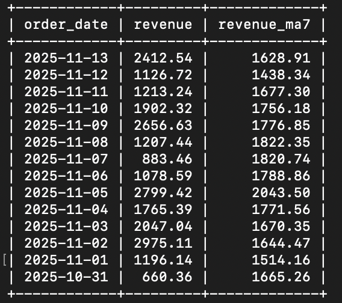
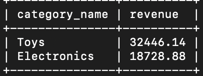
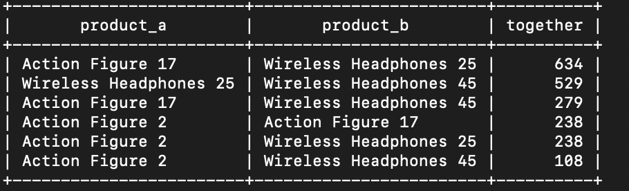
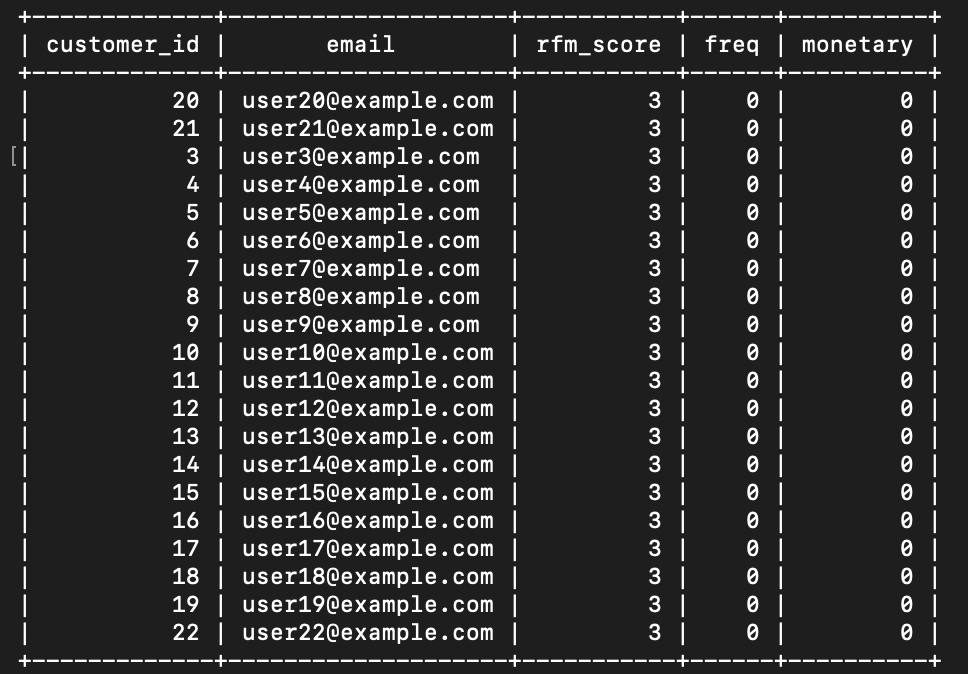

SQL E-commerce Analytics (PostgreSQL)
====================================

**Blurb:** Production-minded SQL mini-warehouse: e-commerce schema, synthetic data, RFM + cohort MVs, inventory trigger, and showcase queries.  
Built for fast cloning and demoing SQL skills.

A mini analytics warehouse on PostgreSQL 16: realistic schema, synthetic data, materialized views (RFM, cohort retention), a daily revenue view, an inventory trigger, and showcase queries.

Quickstart (Docker)
-------------------
1) docker compose -f docker/docker-compose.yml up -d
2) Connect with psql and run:
   \i sql/01_schema_tables.sql
   \i sql/02_seed_data.sql
   \i sql/03_marts.sql
   \i sql/04_triggers_permissions.sql
   SELECT marts.refresh_all();

What’s inside
-------------
- Core: customers, orders, order_items, products, categories, payments, inventory
- Marts:
  - marts.v_order_revenue
  - marts.mv_rfm
  - marts.mv_cohort_retention
- Trigger:
  - core.decrement_inventory() + trg_inv_decrement
- Showcase queries: sql/99_queries_showcase.sql

Screenshots
-----------
## Screenshots

### Daily Revenue (7-Day Moving Average)
  
> 📊 Shows daily gross revenue and a 7-day moving average trend to identify short-term performance fluctuations and seasonality.

### Top Categories (Last 30 Days)
  
> 🧩 Highlights the highest-earning product categories over the past month, useful for marketing and inventory planning.

### Product Basket Pairs
  
> 🛒 Reveals which products are most frequently bought together—helpful for recommendation engines and cross-selling strategy.

### RFM Leaders
  
> 💎 Lists customers with the strongest Recency-Frequency-Monetary (RFM) scores, helping identify high-value, loyal customers.

License
-------
MIT
